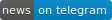
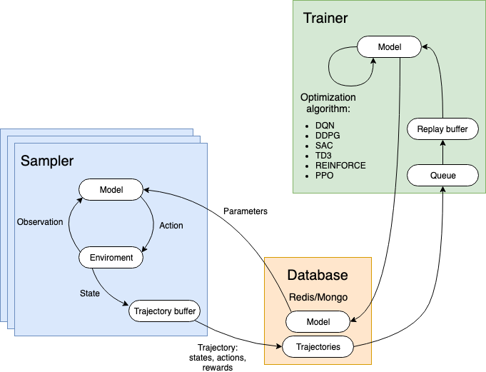

# NeurIPS 2019: Learn to Move – Walk Around<br/>2nd place solution – powered by [Catalyst.RL](https://github.com/catalyst-team/catalyst)

<div align="center">


[](https://t.me/catalyst_team)
[](https://gitter.im/catalyst-team/community?utm_source=badge&utm_medium=badge&utm_campaign=pr-badge)
[](https://opendatascience.slack.com/messages/CGK4KQBHD)

</div>


## How2run

### System requirements

You need to install [Anaconda](www.anaconda.com/download) and Redis:
```
sudo apt install redis-server
```

### Python requirements
(Taken from the official [repo](https://github.com/stanfordnmbl/osim-rl)).

**Anaconda** is required to run our simulations. Anaconda will create a virtual environment with all the necessary libraries, to avoid conflicts with libraries in your operating system. You can get anaconda from here https://docs.anaconda.com/anaconda/install/. In the following instructions we assume that Anaconda is successfully installed.

For the challenge we prepared [OpenSim](http://opensim.stanford.edu/) binaries as a conda environment to make the installation straightforward

We support Windows, Linux, and Mac OSX (all in 64-bit). To install our simulator, you first need to create a conda environment with the OpenSim package.

On **Windows**, open a command prompt and type:
```bash
conda create -n opensim-rl -c kidzik opensim python=3.6.1
activate opensim-rl
```

On **Linux/OSX**, run:
```bash
conda create -n opensim-rl -c kidzik opensim python=3.6
source activate opensim-rl
conda install python=3.6.1 -c conda-forge
```

These commands will create a virtual environment on your computer with the necessary simulation libraries installed. Next, you need to install our python reinforcement learning environment. Type (on all platforms):
```bash
conda install -c conda-forge lapack git -y
pip install osim-rl -y
conda remove nb_conda_kernels -y
conda install -c conda-forge nb_conda_kernels -y
conda install notebook jupyter nb_conda -y
conda remove nbpresent -y
pip install -r ./requirements.txt
```

### Run ensemble training

<div align="center">



[Catalyst.RL](https://github.com/catalyst-team/catalyst) achitecture. Samplers interact with the environment and gather training data. Trainers retrieve collected data and update parameters of value function and policy approximators. All communication is conducted through a database.

</div>

```
export LOGDIR=/path/to/logdir
export PORT=14001
bash bin/prepare_configs.sh

redis-server --port $PORT

CUDA_VISIBLE_DEVICES="0" \
PYTHONPATH="." \
EXP_CONFIG="./configs/_exp_common.yml ./configs/env_l2m.yml ./configs/_dpg_common.yml ./configs/td3.yml" \
DB_SPEC="null" \
OMP_NUM_THREADS=1 MKL_NUM_THREADS=1 catalyst-rl-run \
    --db/prefix=td3-quan-01-04:str \
    --environment/history_len=1:int \
    --environment/frame_skip=4:int

CUDA_VISIBLE_DEVICES="1" \
PYTHONPATH="." \
EXP_CONFIG="./configs/_exp_common.yml ./configs/env_l2m.yml ./configs/_dpg_common.yml ./configs/td3.yml" \
DB_SPEC="null" \
OMP_NUM_THREADS=1 MKL_NUM_THREADS=1 catalyst-rl-run \
    --db/prefix=td3-quan-04-04:str \
    --environment/history_len=4:int \
    --environment/frame_skip=4:int

CUDA_VISIBLE_DEVICES="2" \
PYTHONPATH="." \
EXP_CONFIG="./configs/_exp_common.yml ./configs/env_l2m.yml ./configs/_dpg_common.yml ./configs/td3.yml" \
DB_SPEC="null" \
OMP_NUM_THREADS=1 MKL_NUM_THREADS=1 catalyst-rl-run \
    --db/prefix=td3-quan-08-04:str \
    --environment/history_len=8:int \
    --environment/frame_skip=4:int

CUDA_VISIBLE_DEVICES="3" \
PYTHONPATH="." \
EXP_CONFIG="./configs/_exp_common.yml ./configs/env_l2m.yml ./configs/_dpg_common.yml ./configs/td3.yml" \
DB_SPEC="null" \
OMP_NUM_THREADS=1 MKL_NUM_THREADS=1 catalyst-rl-run \
    --db/prefix=td3-quan-12-04:str \
    --environment/history_len=12:int \
    --environment/frame_skip=4:int
```

### Check results in Tensorboard

<div align="center">


Average raw reward on validation seeds versus training time (in hours).<br/>Different graphs correspond to different history lengths used for training.

</div>


## Additional links [WIP]

1. [Catalyst.RL](https://github.com/catalyst-team/catalyst)
2. [Analysis of the solution - slides (in English)](https://docs.google.com/presentation/d/1g4g_Rxp9M3xAHwpp_hNzC87L9Gvum3H09g2DIQn1Taw/edit?usp=sharing)
3. [Analysis of the solution - video (in Russian)](https://youtu.be/PprDcJHrFdg?t=4020)
4. [Cool video with agent run](https://youtu.be/WuqNdNBVzzI)
5. [NeurIPS 2019: Learn to Move - Walk Around – starter kit](https://github.com/Scitator/learning-to-move-starter-kit)


## Citation
Please cite the following paper if you feel this repository useful.
```
@article{run_skeleton_in3d,
  title={Sample Efficient Ensemble Learning with Catalyst.RL},
  author = {Kolesnikov, Sergey and Khrulkov, Valentin},
  journal={arXiv preprint arXiv:[WIP]},
  year={2019}
}
```
